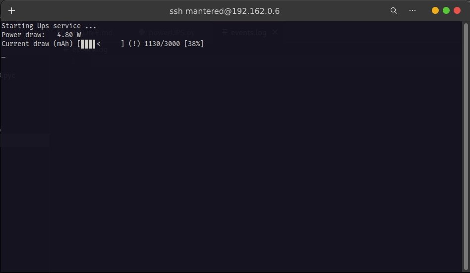

## This is the Python code for [Cheap UPS solution for Raspberry Pi 4b](https://) tutorial from Instructables.

#### It uses an "3A Fast Charge UPS Power Supply module" to provide a cheap power backup solution for Raspberry Pi 4. The INA226 module provides voltage, current and power monitor and is connected by the I2C bus.


To interface with the ina226 module the script uses the [pi_ina226](https://github.com/e71828/pi_ina226/) library.

## Install and usage:

Clone or download the repo:

```console

cd pi4UPS/

pip3 install -r requirements.txt

```

Edit the `powerUPS.py` file and set the following:

##### the sense pin from the battery, the resistor divider output is Low at power loss.

`PowerSense_GPIO = 4`

##### set to False if you don't need scheduled readings.

`heartBeat = True`

##### Change the value based on the shunt resistor installed on your INA266 module.

`shunt = 0.008 ### the shunt resistance in Ohms`

```console

python3 powerUPS.py

```

The script is active, monitoring pin 4 for a power loss event.

Press Ctrl+C to exit the script and stop the monitoring.

## Test

The script has been tested on the Raspi 4b+ on Ubuntu 22.04.4 aarch64 and Python 3.10,
`powerUPS.py `is meant to be used from terminal and `ups_daemon.py` as a service.
Check `events.log` for status/errors of the UPS service.

### Script running in terminal




#### To install as a service on Ubuntu with ***Systemd***:

Edit the `pi4ups.service` file:

- set your actual username after *User=*
- set the *WorkingDirectory=* containing the `ups_daemon.py` file
- set the proper path to your script in *ExecStart=*

Edit the `ups_daemon.py` file, set PowerSense_GPIO and shunt values.

```console

$ sudo cp pi4ups.service /etc/systemd/system/


```

```console

$ sudo systemctl start pi4ups.service

```

```console

$ sudo systemctl enable pi4ups.service

```

Check if the service is running without errors:

```console

$ sudo systemctl status pi4ups.service

```
